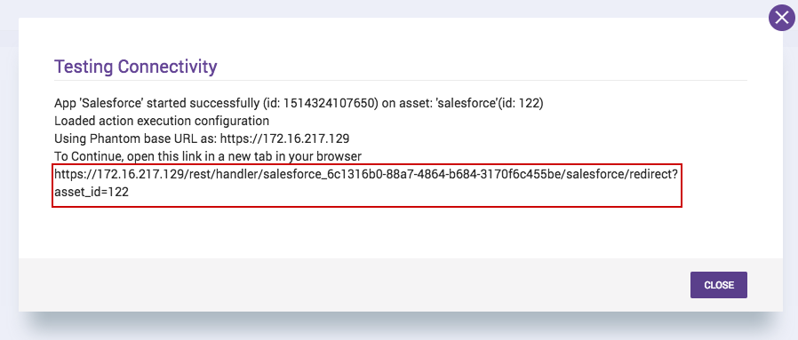

# Salesforce

Publisher: Splunk  
Connector Version: 2.2.0  
Product Vendor: Salesforce  
Product Name: Salesforce  
Minimum Product Version: 6.3.0

This app implements actions to manage objects on Salesforce

## Authentication

Starting with Salesforce Spring '26, new Connected Apps can no longer be created by default.
Salesforce now requires new integrations to use **External Client Apps (ECA)**. This connector
supports External Client Apps in two ways:

- browser-based OAuth authorization using **Enable Authorization Code and Credentials Flow** with
  PKCE and refresh token rotation
- headless server-to-server authentication using **Client Credentials Flow**

> **Note for existing Connected App users:** If you already have a Connected App configured and
> working, it will continue to function. Only new app creation is restricted. Follow the External
> Client App steps below for any new setup.
>
> **Legacy Connected App availability note:** Some Salesforce environments may no longer allow
> creation or use of Connected Apps by default. If your organization still needs the legacy
> Connected App-based authentication flow and the option is unavailable, contact your Salesforce
> administrator, Salesforce account team, or Salesforce support to determine whether it can be
> enabled for your org.

## Choose an Authentication Flow

Choose the flow before you start setup:

1. **Browser-based OAuth with PKCE**: use this flow when an administrator can complete a one-time
   browser login and consent step. This flow uses a callback URL and stores a refresh token for
   later actions. Follow **Steps 1, 2A, 3, and 4A**.
1. **Client Credentials OAuth**: use this flow for headless server-to-server authentication with no
   browser login. This flow does not use a callback URL, PKCE, or refresh tokens. Follow
   **Steps 1, 2B, 3, and 4B**.
1. **Username-password OAuth**: this is a legacy flow for existing Connected Apps only. It is not
   recommended for new External Client App setups.

## Step 1: Open External Client App Manager in Salesforce

1. Sign in to Salesforce.
1. Open **Setup**.
1. In Setup, use either of these navigation paths:
   - left navigation: **Apps** -> **External Client Apps** -> **External Client App Manager**
   - **Quick Find** search: type `External Client App Manager` and select it
1. Click **New External Client App**.
1. Under **Basic Information**, fill in:
   - **External Client App Name**: for example, `Salesforce Splunk SOAR App`
   - **API Name**: keep the default or use `Salesforce_Splunk_SOAR_App`
   - **Contact Email**: your admin or support email address
   - **Distribution State**: `Local`
1. Expand **API (Enable OAuth Settings)** and select **Enable OAuth**.
1. If Salesforce requires a **Callback URL** during creation, enter a temporary placeholder value
   such as `https://placeholder.example/callback`. Browser OAuth users replace this later in
   Step 4A. Client Credentials users do not use this callback URL.

## Step 2A: Configure Browser-Based OAuth Settings

Use this step only for browser-based OAuth with PKCE.

1. Under **Available OAuth Scopes**, move these scopes to **Selected OAuth Scopes**:
   - `Manage user data via APIs (api)`
   - `Perform requests at any time (refresh_token, offline_access)`
1. Under **Flow Enablement**, select **Enable Authorization Code and Credentials Flow**.
1. Leave **Require user credentials in the POST body for Authorization Code and Credentials Flow**
   unchecked.
1. Under **Security**, select:
   - `Require Proof Key for Code Exchange (PKCE) Extension for Supported Authorization Flows`
   - `Require Secret for Web Server Flow`
   - `Require Secret for Refresh Token Flow`
1. Click **Create** or **Save**.

## Step 2B: Configure Client Credentials Settings

Use this step only for Client Credentials OAuth.

1. Under **Available OAuth Scopes**, move this scope to **Selected OAuth Scopes**:
   - `Manage user data via APIs (api)`
1. Click **Create** or **Save**.
1. Open the external client app.
1. On the **Settings** tab, expand **OAuth Settings**.
1. If your Salesforce screen shows **Enable Client Credentials Flow** on the settings page, select
   it and save the settings.
1. Open the **Policies** tab.
1. Expand **OAuth Policies** and click **Edit**.
1. In **OAuth Flows and External Client App Enhancements**, select **Enable Client Credentials
   Flow**.
1. In **Run As (Username)**, select or enter the active Salesforce user whose permissions should be
   used for API calls.
1. Do not leave **Run As (Username)** empty. Salesforce rejects Client Credentials requests when no
   Run As user is assigned.
1. The access token acts as this **Run As** user. The connector can only read, create, update, or
   list data that this user is already allowed to access in Salesforce.
1. Use a dedicated integration user when possible instead of a human administrator account.
1. Grant that user only the permissions required for your use case, typically through permission
   sets or permission set groups. At minimum, review:
   - object permissions for the Salesforce objects the connector will read or modify
   - field-level permissions for any fields the connector must read or write
   - record and list-view access for the specific records or list views used for polling
1. If your org provides the **Salesforce Integration** user license, Salesforce recommends using a
   dedicated integration user with the **Minimum Access - API Only Integrations** profile and then
   granting the required data and operation access through permission sets.
1. To grant access to the **Run As** user in Salesforce:
   - open **Setup**
   - use **Quick Find** and open **Permission Sets**
   - click **New**
   - enter a label such as `Splunk SOAR Salesforce Integration`
   - if you are using the **Salesforce Integration** user license, select the **Salesforce API
     Integration** permission set license when prompted
   - save the permission set
   - open **Object Settings** inside the permission set
   - open each object the connector needs, such as **Account**, **Case**, or custom objects, click
     **Edit**, and enable only the required permissions such as **Read**, **Create**, **Edit**, or
     **Delete**
   - within the same object, review **Field Permissions** and enable access only for the fields the
     connector must read or write
   - click **Manage Assignments** -> **Add Assignments**, select the same user you chose in
     **Run As (Username)**, and assign the permission set
   - if you use polling with a Salesforce list view, make sure that user can see the underlying
     records and the selected list view through your org's sharing and list-view visibility rules
1. Optional quick validation path: if you are only trying to confirm that Client Credentials auth
   works and you are unsure which minimum permissions to grant yet, you can temporarily choose a
   known Salesforce administrator or another user who already has confirmed API, object, field, and
   list-view access. After the smoke test succeeds, switch to a dedicated least-privilege
   integration user for production use.
1. Do not assume a Salesforce username or login email is an administrator account. Confirm the
   user's profile, permission sets, and object access in Salesforce before using that user as
   **Run As (Username)**.
1. Save your changes.

Client Credentials flow does not use `refresh_token`, `offline_access`, PKCE, or the callback URL.

## Step 3: Retrieve Consumer Key and Consumer Secret

1. Open the newly created external client app.
1. Click the **Settings** tab.
1. Expand **OAuth Settings**.
1. Click **Consumer Key and Secret**.
1. If Salesforce sends a verification code to your email, complete that verification step.
1. Copy these two values:
   - **Consumer Key** -> paste into the Splunk SOAR **Client ID** field
   - **Consumer Secret** -> paste into the Splunk SOAR **Client Secret** field

## Step 4A: Configure Splunk SOAR for Browser-Based OAuth

Use this step only when **Use Client Credentials OAuth flow** is unchecked.

1. In Splunk SOAR, open **Apps** and find the **Salesforce** app.
1. Click **Configure New Asset**.
1. In **Asset Settings**, fill in:
   - **Client ID**: the **Consumer Key** from Step 3
   - **Client Secret**: the **Consumer Secret** from Step 3
   - **Use Client Credentials OAuth flow**: unchecked
   - **My Domain URL**: leave blank
   - **Username** and **Password**: leave blank
1. Click **SAVE**.
1. After saving, copy the value shown in **POST incoming for Salesforce to this location** and append
   `/start_oauth`.

The final callback URL looks like:

`https://<splunk_soar_host>/rest/handler/salesforce_6c1316b0-88a7-4864-b684-3170f6c455be/<asset_name>/start_oauth`

1. Return to **External Client App Manager** in Salesforce.
1. Open the same external client app.
1. Use **Edit** or **Edit Settings** for the app, depending on how your Salesforce screen is laid out.
1. In **Callback URL**, replace the temporary placeholder with the `/start_oauth` URL.
1. Save your changes.
1. In Splunk SOAR, click **TEST CONNECTIVITY**.
1. A window displays a URL. Open that URL in a new browser tab.
1. Sign in to Salesforce if prompted.
1. Approve the app when Salesforce asks for consent.
1. Close the browser tab when instructed.
1. The Splunk SOAR test connectivity window should show success.

> **Security note:** This connector uses PKCE (Proof Key for Code Exchange) to protect the
> authorization code flow and supports Salesforce refresh token rotation. If Salesforce issues a new
> refresh token during a session refresh, the connector automatically replaces the stored token so
> the integration remains active. If the stored refresh token later expires, is revoked, or becomes
> invalid, re-run **TEST CONNECTIVITY** to authorize the app again and store a new refresh token.

## Step 4B: Configure Splunk SOAR for Client Credentials OAuth

Use this step only when **Use Client Credentials OAuth flow** is checked.

1. In Salesforce Setup, open **My Domain** using either of these paths:
   - left navigation: **Company Settings** -> **My Domain**
   - **Quick Find** search: type `My Domain` and select it
1. On the **My Domain Details** page, locate **Current My Domain URL**.
1. Copy only the Salesforce hostname or HTTPS URL. Example:
   `d3t000000example-dev-ed.my.salesforce.com`
1. Do **not** copy helper text such as `with enhanced domains`.
1. Do **not** use:
   - the browser address bar host ending in `.lightning.force.com`
   - `login.salesforce.com`
   - `test.salesforce.com`
1. In Splunk SOAR, open **Apps** and find the **Salesforce** app.
1. Click **Configure New Asset**.
1. In **Asset Settings**, fill in:
   - **Client ID**: the **Consumer Key** from Step 3
   - **Client Secret**: the **Consumer Secret** from Step 3
   - **Use Client Credentials OAuth flow**: checked
   - **My Domain URL**: the **Current My Domain URL** value copied above; you can paste either the
     bare hostname or the full `https://` URL
   - **Username** and **Password**: leave blank
1. Click **SAVE**.
1. Click **TEST CONNECTIVITY**.

The connector sends the token request to:

`https://<your-my-domain>/services/oauth2/token`

> **Important:** Salesforce returns `invalid_grant` with `request not supported on this domain`
> when Client Credentials requests are sent to `login.salesforce.com` or `test.salesforce.com`.
> This flow must use your org-specific **My Domain URL** instead. The **Use a Salesforce test
> environment** checkbox does not apply to Client Credentials flow.

## Method to Run Test Connectivity with Username and Password (Legacy)

> **This flow is not recommended for new External Client App setups.** External Client Apps in
> Salesforce no longer support the resource owner password grant by default.

If you are using a legacy Connected App that still allows the username-password flow, you can
optionally specify a username and password in the asset configuration.

When both **Username** and **Password** are provided and **Use Client Credentials OAuth flow** is
unchecked, the asset uses the legacy username-password flow instead of the browser-based OAuth flow.
Leave both fields blank to use the External Client App browser-based OAuth flow described above.

If your Salesforce environment does not show Connected Apps or does not allow this legacy flow,
contact your Salesforce administrator, Salesforce account team, or Salesforce support. This is a
Salesforce-side org setting, not a Splunk SOAR connector setting.

**Note:** The **Password** field must be your Salesforce password with your account's security
token appended at the end. Example: `MyPasswordMyToken` (this is not the same as the
**Client Secret**).

## Test Environment

If your browser-based Salesforce login normally starts at <https://test.salesforce.com> rather than
<https://login.salesforce.com>, enable the **Use a Salesforce test environment** checkbox in the
asset configuration before running browser OAuth test connectivity.

This checkbox applies to browser OAuth and the legacy username-password flow. Client Credentials
flow uses the **My Domain URL** field instead.

## Ingestion

### Common points for scheduled interval polling and manual polling

- The parameters of the On Poll action ignored in this application are start_time, end_time,
  container_id, artifact_count.

- The data will be fetched based on the value specified in the configuration parameters 'Poll for
  this Salesforce Object'(default value is Case if not specified) and 'Poll this List View'
  parameter. To ingest objects, a ListView should be specified.

- The created artifact's CEF fields will be the same names as the fields in the Object in
  Salesforce. You may want to map these to standard CEF fields. This can be done by providing a
  JSON that describes the mapping. For example, if the Salesforce object has the field
  **ip_address\_\_c** , and you want this to be **sourceAddress** , the following file would be
  appropriate: `{"ip_address__c": "sourceAddress"}`.

### 'Include view data in artifact' Configuration Parameter

- This configuration parameter can be used to prevent the creation of duplicate artifacts.
- If disabled, the on poll will ignore the value of "LastViewedDate" and "LastReferencedDate"
  during artifact creation.
- If enabled, the on poll will include the value of "LastViewedDate" and "LastReferencedDate"
  during artifact creation.
- Case is an example of an object in which both the values (LastViewedDate and LastReferencedDate)
  are present.

### Scheduled | Interval polling

- During scheduled | interval polling, the app will start from the first object and will ingest
  up to the number of objects specified in the 'Get this many results on first ingestion'(Default
  value 10) parameter. Then it remembers the last object's offset Id and stores it in the state
  file against the key 'cur_offset'. The next scheduled ingestion will start from the offset Id in
  the state file and will ingest all the remaining objects of defined ListView.

### Manual polling

- During manual polling, the app will start from the first object and will ingest up to the number
  of objects specified in the 'Maximum containers' parameter.

## Note

- Currently, the **List Objects** , the **List Tickets** , and the **On Poll** actions can fetch a
  maximum of 4000 records. The maximum offset value supported by the Salesforce API is 2000, as
  mentioned in this [**documentation**
  .](https://developer.salesforce.com/docs/atlas.en-us.soql_sosl.meta/soql_sosl/sforce_api_calls_soql_select_offset.htm)
  If this issue gets resolved with the Salesforce API, then the mentioned actions will be able to
  fetch all of the records.
- The List of available standard objects can be found
  [here](https://developer.salesforce.com/docs/atlas.en-us.object_reference.meta/object_reference/sforce_api_objects_list.htm)
  .
- While using custom object's name as input parameter use "API Name" attribute of that object.

### Configuration variables

This table lists the configuration variables required to operate Salesforce. These variables are specified when configuring a Salesforce asset in Splunk SOAR.

VARIABLE | REQUIRED | TYPE | DESCRIPTION
-------- | -------- | ---- | -----------
**client_id** | required | string | Salesforce OAuth client identifier, also called the consumer key. |
**client_secret** | required | password | Salesforce OAuth client secret, also called the consumer secret. |
**use_client_credentials** | optional | boolean | Use Salesforce Client Credentials OAuth flow. |
**domain_url** | optional | string | Salesforce Current My Domain URL used for Client Credentials flow. |
**username** | optional | string | (Legacy) Username for username-password OAuth flow. Not required for External Client App setup. |
**password** | optional | password | (Legacy) Password with security token appended. Not required for External Client App setup. |
**is_test_environment** | optional | boolean | Use a Salesforce test environment for browser OAuth and legacy username-password flows |
**poll_sobject** | optional | string | Poll for this Salesforce Object |
**poll_view_name** | optional | string | Poll this List View |
**first_ingestion_max** | optional | numeric | Get this many results on first ingestion |
**cef_name_map** | optional | file | Mapping of Salesforce to CEF fields (JSON file) |
**last_view_date** | optional | boolean | Include view date in artifact |

### Supported Actions

[test connectivity](#action-test-connectivity) - Validate connection using the configured credentials  
[run query](#action-run-query) - Run a query using the Salesforce Object Query Language (SOQL)  
[create object](#action-create-object) - Create a new Salesforce object  
[create ticket](#action-create-ticket) - Create a new Case  
[delete object](#action-delete-object) - Delete an object  
[delete ticket](#action-delete-ticket) - Delete a Case  
[update object](#action-update-object) - Update an object  
[update ticket](#action-update-ticket) - Update a Case  
[list objects](#action-list-objects) - Get a list of objects  
[list tickets](#action-list-tickets) - Get a list of Cases  
[get object](#action-get-object) - Get info about a Salesforce object  
[get ticket](#action-get-ticket) - Get info about a Case  
[post chatter](#action-post-chatter) - Post on the Chatter feed for a specified case  
[on poll](#action-on-poll) - Poll for new Objects on Salesforce

## action: 'test connectivity'

Validate connection using the configured credentials

Type: **test**  
Read only: **True**

#### Action Parameters

No parameters are required for this action

#### Action Output

No Output

## action: 'run query'

Run a query using the Salesforce Object Query Language (SOQL)

Type: **investigate**  
Read only: **True**

To run a query that includes a wildcard character, use <code>%25</code> instead of <code>%</code>.

#### Action Parameters

PARAMETER | REQUIRED | DESCRIPTION | TYPE | CONTAINS
--------- | -------- | ----------- | ---- | --------
**query** | required | SOQL Query | string | |
**endpoint** | required | Which Query endpoint to use | string | |

#### Action Output

DATA PATH | TYPE | CONTAINS | EXAMPLE VALUES
--------- | ---- | -------- | --------------
action_result.status | string | | success failed |
action_result.parameter.endpoint | string | | query |
action_result.parameter.query | string | | SELECT+name+from+Account |
action_result.data.\*.records.\* | string | | |
action_result.summary.num_objects | numeric | | 20 |
action_result.message | string | | Successfully retrieved query results |
summary.total_objects | numeric | | 1 |
summary.total_objects_successful | numeric | | 1 |

## action: 'create object'

Create a new Salesforce object

Type: **generic**  
Read only: **False**

#### Action Parameters

PARAMETER | REQUIRED | DESCRIPTION | TYPE | CONTAINS
--------- | -------- | ----------- | ---- | --------
**sobject** | required | Name of object | string | `salesforce object name` |
**field_values** | required | JSON Object of Key-Value pairs to update | string | |

#### Action Output

DATA PATH | TYPE | CONTAINS | EXAMPLE VALUES
--------- | ---- | -------- | --------------
action_result.status | string | | success failed |
action_result.parameter.field_values | string | | {"SITracker_Handoff_Notes\_\_c": "Be sure to review the handoff notes!"} |
action_result.parameter.sobject | string | `salesforce object name` | Case |
action_result.data.\*.id | string | `salesforce object id` | 5001I000002SfMMQA0 |
action_result.data.\*.success | boolean | | True False |
action_result.summary.obj_id | string | `salesforce object id` | 5001I000002SfMMQA0 |
action_result.message | string | | Successfully created a new Object |
summary.total_objects | numeric | | 1 |
summary.total_objects_successful | numeric | | 1 |

## action: 'create ticket'

Create a new Case

Type: **generic**  
Read only: **False**

#### Action Parameters

PARAMETER | REQUIRED | DESCRIPTION | TYPE | CONTAINS
--------- | -------- | ----------- | ---- | --------
**parent_case_id** | optional | Object ID of Parent Case | string | `salesforce object id` |
**subject** | optional | Subject | string | |
**priority** | optional | Priority | string | |
**description** | optional | Description | string | |
**field_values** | optional | JSON Object of Key-Value pairs to update | string | |

#### Action Output

DATA PATH | TYPE | CONTAINS | EXAMPLE VALUES
--------- | ---- | -------- | --------------
action_result.status | string | | success failed |
action_result.parameter.description | string | | This is a test description |
action_result.parameter.field_values | string | | {"SITracker_Handoff_Notes\_\_c": "Be sure to review the handoff notes!"} |
action_result.parameter.parent_case_id | string | `salesforce object id` | 0061I000000PRsCABC |
action_result.parameter.priority | string | | High |
action_result.parameter.subject | string | | Generic Chatter |
action_result.data.\*.id | string | `salesforce object id` | 5001I000002SfMMQA0 |
action_result.data.\*.success | boolean | | True False |
action_result.summary.obj_id | string | `salesforce object id` | 5001I000002SfMMQA0 |
action_result.message | string | | Successfully created a new Case |
summary.total_objects | numeric | | 1 |
summary.total_objects_successful | numeric | | 1 |

## action: 'delete object'

Delete an object

Type: **generic**  
Read only: **False**

#### Action Parameters

PARAMETER | REQUIRED | DESCRIPTION | TYPE | CONTAINS
--------- | -------- | ----------- | ---- | --------
**sobject** | required | Name of object | string | `salesforce object name` |
**id** | required | Salesforce Object ID | string | `salesforce object id` |

#### Action Output

DATA PATH | TYPE | CONTAINS | EXAMPLE VALUES
--------- | ---- | -------- | --------------
action_result.status | string | | success failed |
action_result.parameter.id | string | `salesforce object id` | 5001I000002StPCQA0 |
action_result.parameter.sobject | string | `salesforce object name` | Case |
action_result.data | string | | |
action_result.summary | string | | |
action_result.message | string | | Successfully deleted the Contact |
summary.total_objects | numeric | | 1 |
summary.total_objects_successful | numeric | | 1 |

## action: 'delete ticket'

Delete a Case

Type: **generic**  
Read only: **False**

#### Action Parameters

PARAMETER | REQUIRED | DESCRIPTION | TYPE | CONTAINS
--------- | -------- | ----------- | ---- | --------
**id** | required | Object ID of the Case | string | `salesforce object id` |

#### Action Output

DATA PATH | TYPE | CONTAINS | EXAMPLE VALUES
--------- | ---- | -------- | --------------
action_result.status | string | | success failed |
action_result.parameter.id | string | `salesforce object id` | 5001I000002StPCQA0 |
action_result.data | string | | |
action_result.summary | string | | |
action_result.message | string | | Successfully deleted the Case |
summary.total_objects | numeric | | 1 |
summary.total_objects_successful | numeric | | 1 |

## action: 'update object'

Update an object

Type: **generic**  
Read only: **False**

#### Action Parameters

PARAMETER | REQUIRED | DESCRIPTION | TYPE | CONTAINS
--------- | -------- | ----------- | ---- | --------
**sobject** | required | Name of object | string | `salesforce object name` |
**id** | required | Salesforce Object ID | string | `salesforce object id` |
**field_values** | optional | JSON Object of Key-Value pairs to update | string | |

#### Action Output

DATA PATH | TYPE | CONTAINS | EXAMPLE VALUES
--------- | ---- | -------- | --------------
action_result.status | string | | success failed |
action_result.parameter.field_values | string | | {"SITracker_Handoff_Notes\_\_c": "Be sure to review the handoff notes"} |
action_result.parameter.id | string | `salesforce object id` | 5001I000002SdASQA0 |
action_result.parameter.sobject | string | `salesforce object name` | Case |
action_result.data | string | | |
action_result.summary.obj_id | string | `salesforce object id` | 0D51I00000Jw1tnSAB |
action_result.message | string | | Successfully updated the Contact |
summary.total_objects | numeric | | 1 |
summary.total_objects_successful | numeric | | 1 |

## action: 'update ticket'

Update a Case

Type: **generic**  
Read only: **False**

#### Action Parameters

PARAMETER | REQUIRED | DESCRIPTION | TYPE | CONTAINS
--------- | -------- | ----------- | ---- | --------
**id** | required | Object ID of the Case | string | `salesforce object id` |
**parent_case_id** | optional | Object ID of Parent Case | string | `salesforce object id` |
**subject** | optional | Subject | string | |
**priority** | optional | Priority | string | |
**description** | optional | Description | string | |
**status** | optional | Status | string | |
**field_values** | optional | JSON Object of Key-Value pairs to update | string | |

#### Action Output

DATA PATH | TYPE | CONTAINS | EXAMPLE VALUES
--------- | ---- | -------- | --------------
action_result.status | string | | success failed |
action_result.parameter.description | string | | This is a test description |
action_result.parameter.field_values | string | | {"SITracker_Handoff_Notes\_\_c": "Be sure to review the handoff notes"} |
action_result.parameter.id | string | `salesforce object id` | 5001I000002SdASQA0 |
action_result.parameter.parent_case_id | string | `salesforce object id` | |
action_result.parameter.priority | string | | High |
action_result.parameter.status | string | | Closed |
action_result.parameter.subject | string | | Generic Chatter |
action_result.data | string | | |
action_result.summary.obj_id | string | `salesforce object id` | 0D51I00000Jw1tnSAB |
action_result.message | string | | Successfully updated the Case |
summary.total_objects | numeric | | 1 |
summary.total_objects_successful | numeric | | 1 |

## action: 'list objects'

Get a list of objects

Type: **investigate**  
Read only: **True**

To get a list of objects, you must specify the name of a list view. By leaving the <b>view_name</b> blank, this action will instead return a list of valid names in the summary. Also, this action will only work if the specified object has a list view. If it does not, you could use the <b>run query</b> action instead.

#### Action Parameters

PARAMETER | REQUIRED | DESCRIPTION | TYPE | CONTAINS
--------- | -------- | ----------- | ---- | --------
**sobject** | required | Name of object | string | `salesforce object name` |
**view_name** | optional | Unique name of a list view | string | `salesforce listview name` |
**limit** | optional | Paging limit | numeric | |
**offset** | optional | Paging offset | numeric | |

#### Action Output

DATA PATH | TYPE | CONTAINS | EXAMPLE VALUES
--------- | ---- | -------- | --------------
action_result.status | string | | success failed |
action_result.parameter.limit | numeric | | 20 |
action_result.parameter.offset | numeric | | 5 |
action_result.parameter.sobject | string | `salesforce object name` | Case |
action_result.parameter.view_name | string | `salesforce listview name` | RecentlyViewedCases |
action_result.data.\* | string | | |
action_result.data.\*.columns.Id.value | string | `salesforce object id` | 0033t000035qrSYAAY |
action_result.summary.num_objects | numeric | | 3 |
action_result.summary.view_names | string | | MyCases |
action_result.message | string | | Listed the valid view names Successfully fetched a list of Contact objects |
summary.total_objects | numeric | | 1 |
summary.total_objects_successful | numeric | | 1 |

## action: 'list tickets'

Get a list of Cases

Type: **investigate**  
Read only: **True**

To get a list of objects, you must specify the name of a list view. By leaving the <b>view_name</b> blank, this action will instead return a list of valid names in the summary.

#### Action Parameters

PARAMETER | REQUIRED | DESCRIPTION | TYPE | CONTAINS
--------- | -------- | ----------- | ---- | --------
**view_name** | optional | Unique name of a list view | string | `salesforce listview name` |
**limit** | optional | Paging limit | numeric | |
**offset** | optional | Paging offset | numeric | |

#### Action Output

DATA PATH | TYPE | CONTAINS | EXAMPLE VALUES
--------- | ---- | -------- | --------------
action_result.status | string | | success failed |
action_result.parameter.limit | numeric | | 20 |
action_result.parameter.offset | numeric | | 5 |
action_result.parameter.view_name | string | `salesforce listview name` | RecentlyViewedCases |
action_result.data.\*.columns.CaseNumber.value | string | | 00001028 |
action_result.data.\*.columns.ContactId.value | string | `salesforce object id` | 0033t000035qrSWABZ |
action_result.data.\*.columns.Contact_Id.value | string | `salesforce object id` | 0033t000035qrSWABZ |
action_result.data.\*.columns.Contact_Name.value | string | | Abcd |
action_result.data.\*.columns.CreatedDate.value | string | | Thu Nov 30 23:50:55 GMT 2017 |
action_result.data.\*.columns.Id.value | string | `salesforce object id` | 5001I000002Sd2hQAC |
action_result.data.\*.columns.LastModifiedDate.value | string | | Fri Dec 01 00:17:47 GMT 2017 |
action_result.data.\*.columns.OwnerId.value | string | `salesforce object id` | 0051I000000PRsCQAW |
action_result.data.\*.columns.Owner_Id.value | string | `salesforce object id` | 0051I000000PRsCQAW |
action_result.data.\*.columns.Owner_NameOrAlias.value | string | | testuser |
action_result.data.\*.columns.Priority.value | string | | Medium |
action_result.data.\*.columns.RecordTypeId.value | string | | 0121I000000F7aZQAS |
action_result.data.\*.columns.Status.value | string | | In-Progress |
action_result.data.\*.columns.Subject.value | string | | Panic |
action_result.data.\*.columns.SystemModstamp.value | string | | Sat Dec 02 11:18:29 GMT 2017 |
action_result.summary.num_objects | numeric | | 3 |
action_result.summary.view_names | string | | MyCases |
action_result.message | string | | Listed the valid view names Successfully fetched a list of Case objects |
summary.total_objects | numeric | | 1 |
summary.total_objects_successful | numeric | | 1 |
action_result.parameter.ph | ph | | |

## action: 'get object'

Get info about a Salesforce object

Type: **investigate**  
Read only: **True**

If you have custom fields added to an object, then they might not show up in the playbook editor, so you will need to manually type the datapath to use it.

#### Action Parameters

PARAMETER | REQUIRED | DESCRIPTION | TYPE | CONTAINS
--------- | -------- | ----------- | ---- | --------
**sobject** | required | Name of object | string | `salesforce object name` |
**id** | required | Salesforce Object ID | string | `salesforce object id` |

#### Action Output

DATA PATH | TYPE | CONTAINS | EXAMPLE VALUES
--------- | ---- | -------- | --------------
action_result.status | string | | success failed |
action_result.parameter.id | string | `salesforce object id` | 5001I000002SfMMQA0 |
action_result.parameter.sobject | string | `salesforce object name` | Case |
action_result.data.\* | string | | |
action_result.data.\*.id | string | `salesforce object id` | 5001I000002SfMMQA0 |
action_result.summary | string | | |
action_result.message | string | | Successfully retrieved Contact |
summary.total_objects | numeric | | 1 |
summary.total_objects_successful | numeric | | 1 |

## action: 'get ticket'

Get info about a Case

Type: **investigate**  
Read only: **True**

If you have custom fields added to a Case, then they might not show up in the playbook editor, so you will need to manually type the datapath to use it.

#### Action Parameters

PARAMETER | REQUIRED | DESCRIPTION | TYPE | CONTAINS
--------- | -------- | ----------- | ---- | --------
**id** | required | Object ID of the Case | string | `salesforce object id` |

#### Action Output

DATA PATH | TYPE | CONTAINS | EXAMPLE VALUES
--------- | ---- | -------- | --------------
action_result.status | string | | success failed |
action_result.parameter.id | string | `salesforce object id` | 5001I000002SfMMQA0 |
action_result.data.\*.AccountId | string | `salesforce object id` | 0013t00001ZyVVTAB4 |
action_result.data.\*.AssetId | string | | |
action_result.data.\*.CaseNumber | string | | 00001030 |
action_result.data.\*.Case_Open_minutes\_\_c | numeric | | 4218 |
action_result.data.\*.ClosedDate | string | | 2019-06-25T18:59:51.000+0000 |
action_result.data.\*.Closed_Time_Days\_\_c | string | | |
action_result.data.\*.ContactEmail | string | | test@example.com |
action_result.data.\*.ContactFax | string | | (1) 234 567 |
action_result.data.\*.ContactId | string | `salesforce object id` | 0033t000035qrSWABZ |
action_result.data.\*.ContactMobile | string | | (1) 222 333 |
action_result.data.\*.ContactPhone | string | | (1) 33 444 |
action_result.data.\*.CreatedById | string | `salesforce object id` | 0051I000000PRsCQAW |
action_result.data.\*.CreatedDate | string | | 2017-12-01T21:32:33.000+0000 |
action_result.data.\*.Customer_Impacting\_\_c | string | | |
action_result.data.\*.Date_Reviewed\_\_c | string | | |
action_result.data.\*.Days_Open\_\_c | numeric | | 3 |
action_result.data.\*.Description | string | | Case Description |
action_result.data.\*.Discovery_Method\_\_c | string | | |
action_result.data.\*.Discovery_Time_Hours\_\_c | string | | |
action_result.data.\*.EngineeringReqNumber\_\_c | string | | 765810 |
action_result.data.\*.Executive_Summary\_\_c | string | | |
action_result.data.\*.Id | string | `salesforce object id` | 5001I000002SfMMQA0 |
action_result.data.\*.Impact_Summary\_\_c | string | | |
action_result.data.\*.Impacted_Environment\_\_c | string | | |
action_result.data.\*.Incident_Category\_\_c | string | | |
action_result.data.\*.Incident_Date\_\_c | string | | |
action_result.data.\*.Incident_Root_Cause\_\_c | string | | |
action_result.data.\*.Incident_Sensitivity\_\_c | string | | |
action_result.data.\*.Incident_Severity\_\_c | string | | |
action_result.data.\*.Incident_Type\_\_c | string | | |
action_result.data.\*.Investigation_Category\_\_c | string | | |
action_result.data.\*.Investigation_Date\_\_c | string | | |
action_result.data.\*.Investigation_Summary\_\_c | string | | |
action_result.data.\*.Investigation_Type\_\_c | string | | |
action_result.data.\*.IsClosed | boolean | | True False |
action_result.data.\*.IsDeleted | boolean | | True False |
action_result.data.\*.IsEscalated | boolean | | True False |
action_result.data.\*.LastModifiedById | string | `salesforce object id` | 0051I000000PRsCQAW |
action_result.data.\*.LastModifiedDate | string | | 2017-12-01T21:32:33.000+0000 |
action_result.data.\*.LastReferencedDate | string | | 2017-12-01T21:33:05.000+0000 |
action_result.data.\*.LastViewedDate | string | | 2017-12-01T21:33:05.000+0000 |
action_result.data.\*.Origin | string | | |
action_result.data.\*.OwnerId | string | `salesforce object id` | 0051I000000PRsCQAW |
action_result.data.\*.ParentId | string | `salesforce object id` | 0061I000000PRsCABC |
action_result.data.\*.PotentialLiability\_\_c | string | | No |
action_result.data.\*.Priority | string | | High |
action_result.data.\*.Product\_\_c | string | | GC5555 |
action_result.data.\*.Reason | string | | Test Complexity |
action_result.data.\*.RecordTypeId | string | | 0121I000000F7aZQAS |
action_result.data.\*.Resolution_Date\_\_c | string | | |
action_result.data.\*.Resolution_Time_Hours\_\_c | string | | |
action_result.data.\*.Response_Time_Hours\_\_c | string | | |
action_result.data.\*.Response_Time_Minutes\_\_c | numeric | | 4218 |
action_result.data.\*.SITrack_Response_Task\_\_c | string | | |
action_result.data.\*.SITracker_Handoff_Notes\_\_c | string | | |
action_result.data.\*.SITracker_Include_in_Handoff\_\_c | boolean | | True False |
action_result.data.\*.SLAViolation\_\_c | string | | |
action_result.data.\*.Status | string | | New |
action_result.data.\*.Subject | string | | Case Subject |
action_result.data.\*.SuppliedCompany | string | | |
action_result.data.\*.SuppliedEmail | string | | |
action_result.data.\*.SuppliedName | string | | |
action_result.data.\*.SuppliedPhone | string | | |
action_result.data.\*.SystemModstamp | string | | 2017-12-02T11:18:29.000+0000 |
action_result.data.\*.Type | string | | Electrical |
action_result.data.\*.attributes.type | string | | Case |
action_result.data.\*.attributes.url | string | | /services/data/v41.0/sobjects/Case/5001I000002SfMMQA0 |
action_result.summary | string | | |
action_result.message | string | | Successfully retrieved Case |
summary.total_objects | numeric | | 1 |
summary.total_objects_successful | numeric | | 1 |

## action: 'post chatter'

Post on the Chatter feed for a specified case

Type: **generic**  
Read only: **False**

#### Action Parameters

PARAMETER | REQUIRED | DESCRIPTION | TYPE | CONTAINS
--------- | -------- | ----------- | ---- | --------
**id** | required | Object ID of the Case | string | `salesforce object id` |
**title** | optional | Title of the post | string | |
**body** | required | Body of the post | string | |

#### Action Output

DATA PATH | TYPE | CONTAINS | EXAMPLE VALUES
--------- | ---- | -------- | --------------
action_result.status | string | | success failed |
action_result.parameter.body | string | | A thing is happening |
action_result.parameter.id | string | `salesforce object id` | 5001I000003mHF2QAM |
action_result.parameter.title | string | | |
action_result.data.\*.id | string | `salesforce object id` | 0D51I00000Jw1tnSAB |
action_result.data.\*.success | boolean | | True False |
action_result.summary.obj_id | string | `salesforce object id` | 0D51I00000Jw1tnSAB |
action_result.message | string | | Successfully posted to chatter |
summary.total_objects | numeric | | 1 |
summary.total_objects_successful | numeric | | 1 |

## action: 'on poll'

Poll for new Objects on Salesforce

Type: **ingest**  
Read only: **True**

#### Action Parameters

PARAMETER | REQUIRED | DESCRIPTION | TYPE | CONTAINS
--------- | -------- | ----------- | ---- | --------
**start_time** | optional | Parameter Ignored in this app | numeric | |
**end_time** | optional | Parameter Ignored in this app | numeric | |
**container_id** | optional | Parameter Ignored in this app | numeric | |
**container_count** | required | Maximum number of objects to ingest | numeric | |
**artifact_count** | optional | Parameter Ignored in this app | numeric | |

#### Action Output

No Output

______________________________________________________________________

Auto-generated Splunk SOAR Connector documentation.

Copyright 2026 Splunk Inc.

Licensed under the Apache License, Version 2.0 (the "License");
you may not use this file except in compliance with the License.
You may obtain a copy of the License at

http://www.apache.org/licenses/LICENSE-2.0

Unless required by applicable law or agreed to in writing,
software distributed under the License is distributed on an "AS IS" BASIS,
WITHOUT WARRANTIES OR CONDITIONS OF ANY KIND, either express or implied.
See the License for the specific language governing permissions and limitations under the License.
