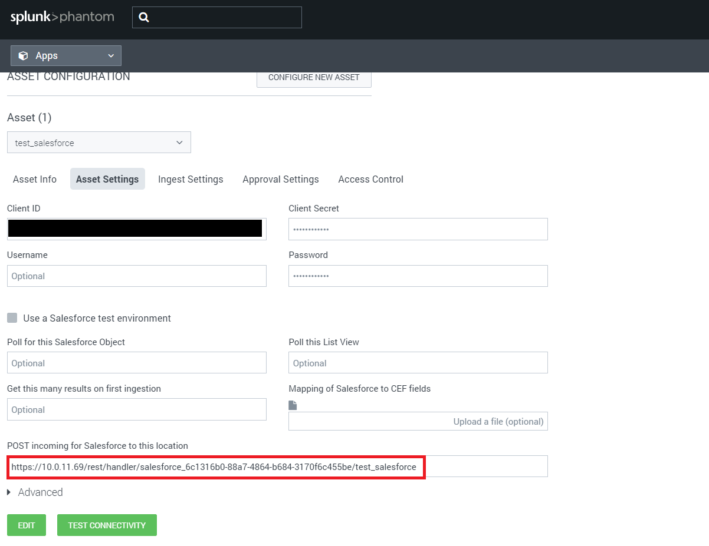

# Salesforce

Publisher: Splunk \
Connector Version: 2.1.4 \
Product Vendor: Salesforce \
Product Name: Salesforce \
Minimum Product Version: 5.5.0

This app implements actions to manage objects on Salesforce

## Authentication

To pass test connectivity, you need to configure an app on Salesforce. To do so, navigate to
<https://www.salesforce.com/> in a browser and navigate to the login page. Log in with a Salesforce
account.

1. In the drop-down list of the account (in the upper-right corner), select **Setup**
1. Go to **Apps** , then **App Manager** and click on **New Connected App**
1. On the New Connected App page, fill the following required fields under Basic Information:
   - Connected App Name. For example, Salesforce Splunk SOAR App
   - API name. For example, Salesforce Splunk SOAR App
   - Contact Email. For example, xyz@xyz.com
1. Go to API (Enable OAuth Settings), and select Enable OAuth Settings. Fill it out as mention in
   the below image or else follow these steps
   - Under the **Callback URL** , we will be updating the entry of https://splunk_soar.local to
     reflect the actual redirect URI. We will get this while we create Splunk SOAR App's asset in
     the below section titled "Configure the Salesforce Phantom app's Asset"

   - Under **Selected OAuth Scopes field** add the following two scopes from **Available OAuth
     Scopes**

     - Access and manage your data(api)
     - Perform requests on your behalf at any time(refresh_token,ofline_access)

   - Select the **Require Secret for Web Server Flow** checkbox

     [](img/app_config.png)
1. Click on **Save**

## Configure the Salesforce Splunk SOAR app's Asset

When creating an asset for the **Salesforce** app, place the **Consumer Key** of the app created
during the previous step in the **Client ID** field and place the **Consumer Secret** generated
during the app creation process in the **Client Secret** field. Then, click **SAVE** .

After saving, a new field will appear in the **Asset Settings** tab. Take the URL found in the
**POST incoming for Salesforce to this location** field. To this URL, add **/start_oauth** . After
doing so the URL should look something like:

https://\<splunk_soar_host>/rest/handler/salesforce_6c1316b0-88a7-4864-b684-3170f6c455be/\<asset_name>/start_oauth

[](img/asset_config.png)

Click **Edit** on the app created in a previous step and place it in the **Callback URL** field.

Once again, click on Save.

## Method to Run Test Connectivity with Oauth

After setting up the asset, click the **TEST CONNECTIVITY** button. A window should pop up and
display a URL as shown in the below image. Navigate to this URL in a separate browser tab. This new
tab will redirect to a Salesforce login page. Log in to a Salesforce account. Finally, close that
tab when instructed to do. The test connectivity window should show a success. **The app should now
be ready to use.**

[](img/modal.png)

## Method to Run Test Connectivity with Username and Password

If you optionally specify username and password in the asset configuration, test connectivity will
work differently; the main difference being that when you launch the test connectivity, there is no
need to log into the Salesforce instance to authorize the app.

**Note:** The password field should be composed of your password with your account's security token
appended at the end. Example: MyPasswordMyToken (this is not the same as the **client_secret** )

## Test Environment

You may want to configure an asset to work with a Salesforce test environment. This is the case if
the login URL for that Salesforce instance is <https://test.salesforce.com> as opposed to
<https://login.salesforce.com> . In this case, you should check the appropriate box in the asset
configuration.

## Ingestion

### Common points for scheduled interval polling and manual polling

- The parameters of the On Poll action ignored in this application are start_time, end_time,
  container_id, artifact_count.

- The data will be fetched based on the value specified in the configuration parameters 'Poll for
  this Salesforce Object'(default value is Case if not specified) and 'Poll this List View'
  parameter. To ingest objects, a ListView should be specified.

- The created artifact's CEF fields will be the same names as the fields in the Object in
  Salesforce. You may want to map these to standard CEF fields. This can be done by providing a
  JSON that describes the mapping. For example, if the Salesforce object has the field
  **ip_address\_\_c** , and you want this to be **sourceAddress** , the following file would be
  appropriate.

  ```shell
                  
                  {
                      "ip_address__c": "sourceAddress"
                  }
                  
                  
  ```

### 'Include view data in artifact' Configuration Parameter

- This configuration parameter can be used to prevent the creation of duplicate artifacts.
- If disabled, the on poll will ignore the value of "LastViewedDate" and "LastReferencedDate"
  during artifact creation.
- If enabled, the on poll will include the value of "LastViewedDate" and "LastReferencedDate"
  during artifact creation.
- Case is an example of an object in which both the values (LastViewedDate and LastReferencedDate)
  are present.

### Scheduled | Interval polling

- During scheduled | interval polling, the app will start from the first object and will ingest
  up to the number of objects specified in the 'Get this many results on first ingestion'(Default
  value 10) parameter. Then it remembers the last object's offset Id and stores it in the state
  file against the key 'cur_offset'. The next scheduled ingestion will start from the offset Id in
  the state file and will ingest all the remaining objects of defined ListView.

### Manual polling

- During manual polling, the app will start from the first object and will ingest up to the number
  of objects specified in the 'Maximum containers' parameter.

## Note

- Currently, the **List Objects** , the **List Tickets** , and the **On Poll** actions can fetch a
  maximum of 4000 records. The maximum offset value supported by the Salesforce API is 2000, as
  mentioned in this [**documentation**
  .](https://developer.salesforce.com/docs/atlas.en-us.soql_sosl.meta/soql_sosl/sforce_api_calls_soql_select_offset.htm)
  If this issue gets resolved with the Salesforce API, then the mentioned actions will be able to
  fetch all of the records.
- The List of available standard objects can be found
  [here](https://developer.salesforce.com/docs/atlas.en-us.object_reference.meta/object_reference/sforce_api_objects_list.htm)
  .
- While using custom object's name as input parameter use "API Name" attribute of that object.

### Configuration variables

This table lists the configuration variables required to operate Salesforce. These variables are specified when configuring a Salesforce asset in Splunk SOAR.

VARIABLE | REQUIRED | TYPE | DESCRIPTION
-------- | -------- | ---- | -----------
**client_id** | required | string | Client ID |
**client_secret** | required | password | Client Secret |
**username** | optional | string | Username |
**password** | optional | password | Password |
**is_test_environment** | optional | boolean | Use a Salesforce test environment |
**poll_sobject** | optional | string | Poll for this Salesforce Object |
**poll_view_name** | optional | string | Poll this List View |
**first_ingestion_max** | optional | numeric | Get this many results on first ingestion |
**cef_name_map** | optional | file | Mapping of Salesforce to CEF fields (JSON file) |
**last_view_date** | optional | boolean | Include view date in artifact |

### Supported Actions

[test connectivity](#action-test-connectivity) - Validate connection using the configured credentials \
[run query](#action-run-query) - Run a query using the Salesforce Object Query Language (SOQL) \
[create object](#action-create-object) - Create a new Salesforce object \
[create ticket](#action-create-ticket) - Create a new Case \
[delete object](#action-delete-object) - Delete an object \
[delete ticket](#action-delete-ticket) - Delete a Case \
[update object](#action-update-object) - Update an object \
[update ticket](#action-update-ticket) - Update a Case \
[list objects](#action-list-objects) - Get a list of objects \
[list tickets](#action-list-tickets) - Get a list of Cases \
[get object](#action-get-object) - Get info about a Salesforce object \
[get ticket](#action-get-ticket) - Get info about a Case \
[post chatter](#action-post-chatter) - Post on the Chatter feed for a specified case \
[on poll](#action-on-poll) - Poll for new Objects on Salesforce

## action: 'test connectivity'

Validate connection using the configured credentials

Type: **test** \
Read only: **True**

#### Action Parameters

No parameters are required for this action

#### Action Output

No Output

## action: 'run query'

Run a query using the Salesforce Object Query Language (SOQL)

Type: **investigate** \
Read only: **True**

To run a query that includes a wildcard character, use <code>%25</code> instead of <code>%</code>.

#### Action Parameters

PARAMETER | REQUIRED | DESCRIPTION | TYPE | CONTAINS
--------- | -------- | ----------- | ---- | --------
**query** | required | SOQL Query | string | |
**endpoint** | required | Which Query endpoint to use | string | |

#### Action Output

DATA PATH | TYPE | CONTAINS | EXAMPLE VALUES
--------- | ---- | -------- | --------------
action_result.status | string | | success failed |
action_result.parameter.endpoint | string | | query |
action_result.parameter.query | string | | SELECT+name+from+Account |
action_result.data.\*.records.\* | string | | |
action_result.summary.num_objects | numeric | | 20 |
action_result.message | string | | Successfully retrieved query results |
summary.total_objects | numeric | | 1 |
summary.total_objects_successful | numeric | | 1 |

## action: 'create object'

Create a new Salesforce object

Type: **generic** \
Read only: **False**

#### Action Parameters

PARAMETER | REQUIRED | DESCRIPTION | TYPE | CONTAINS
--------- | -------- | ----------- | ---- | --------
**sobject** | required | Name of object | string | `salesforce object name` |
**field_values** | required | JSON Object of Key-Value pairs to update | string | |

#### Action Output

DATA PATH | TYPE | CONTAINS | EXAMPLE VALUES
--------- | ---- | -------- | --------------
action_result.status | string | | success failed |
action_result.parameter.field_values | string | | {"SITracker_Handoff_Notes\_\_c": "Be sure to review the handoff notes!"} |
action_result.parameter.sobject | string | `salesforce object name` | Case |
action_result.data.\*.id | string | `salesforce object id` | 5001I000002SfMMQA0 |
action_result.data.\*.success | boolean | | True False |
action_result.summary.obj_id | string | `salesforce object id` | 5001I000002SfMMQA0 |
action_result.message | string | | Successfully created a new Object |
summary.total_objects | numeric | | 1 |
summary.total_objects_successful | numeric | | 1 |

## action: 'create ticket'

Create a new Case

Type: **generic** \
Read only: **False**

#### Action Parameters

PARAMETER | REQUIRED | DESCRIPTION | TYPE | CONTAINS
--------- | -------- | ----------- | ---- | --------
**parent_case_id** | optional | Object ID of Parent Case | string | `salesforce object id` |
**subject** | optional | Subject | string | |
**priority** | optional | Priority | string | |
**description** | optional | Description | string | |
**field_values** | optional | JSON Object of Key-Value pairs to update | string | |

#### Action Output

DATA PATH | TYPE | CONTAINS | EXAMPLE VALUES
--------- | ---- | -------- | --------------
action_result.status | string | | success failed |
action_result.parameter.description | string | | This is a test description |
action_result.parameter.field_values | string | | {"SITracker_Handoff_Notes\_\_c": "Be sure to review the handoff notes!"} |
action_result.parameter.parent_case_id | string | `salesforce object id` | 0061I000000PRsCABC |
action_result.parameter.priority | string | | High |
action_result.parameter.subject | string | | Generic Chatter |
action_result.data.\*.id | string | `salesforce object id` | 5001I000002SfMMQA0 |
action_result.data.\*.success | boolean | | True False |
action_result.summary.obj_id | string | `salesforce object id` | 5001I000002SfMMQA0 |
action_result.message | string | | Successfully created a new Case |
summary.total_objects | numeric | | 1 |
summary.total_objects_successful | numeric | | 1 |

## action: 'delete object'

Delete an object

Type: **generic** \
Read only: **False**

#### Action Parameters

PARAMETER | REQUIRED | DESCRIPTION | TYPE | CONTAINS
--------- | -------- | ----------- | ---- | --------
**sobject** | required | Name of object | string | `salesforce object name` |
**id** | required | Salesforce Object ID | string | `salesforce object id` |

#### Action Output

DATA PATH | TYPE | CONTAINS | EXAMPLE VALUES
--------- | ---- | -------- | --------------
action_result.status | string | | success failed |
action_result.parameter.id | string | `salesforce object id` | 5001I000002StPCQA0 |
action_result.parameter.sobject | string | `salesforce object name` | Case |
action_result.data | string | | |
action_result.summary | string | | |
action_result.message | string | | Successfully deleted the Contact |
summary.total_objects | numeric | | 1 |
summary.total_objects_successful | numeric | | 1 |

## action: 'delete ticket'

Delete a Case

Type: **generic** \
Read only: **False**

#### Action Parameters

PARAMETER | REQUIRED | DESCRIPTION | TYPE | CONTAINS
--------- | -------- | ----------- | ---- | --------
**id** | required | Object ID of the Case | string | `salesforce object id` |

#### Action Output

DATA PATH | TYPE | CONTAINS | EXAMPLE VALUES
--------- | ---- | -------- | --------------
action_result.status | string | | success failed |
action_result.parameter.id | string | `salesforce object id` | 5001I000002StPCQA0 |
action_result.data | string | | |
action_result.summary | string | | |
action_result.message | string | | Successfully deleted the Case |
summary.total_objects | numeric | | 1 |
summary.total_objects_successful | numeric | | 1 |

## action: 'update object'

Update an object

Type: **generic** \
Read only: **False**

#### Action Parameters

PARAMETER | REQUIRED | DESCRIPTION | TYPE | CONTAINS
--------- | -------- | ----------- | ---- | --------
**sobject** | required | Name of object | string | `salesforce object name` |
**id** | required | Salesforce Object ID | string | `salesforce object id` |
**field_values** | optional | JSON Object of Key-Value pairs to update | string | |

#### Action Output

DATA PATH | TYPE | CONTAINS | EXAMPLE VALUES
--------- | ---- | -------- | --------------
action_result.status | string | | success failed |
action_result.parameter.field_values | string | | {"SITracker_Handoff_Notes\_\_c": "Be sure to review the handoff notes"} |
action_result.parameter.id | string | `salesforce object id` | 5001I000002SdASQA0 |
action_result.parameter.sobject | string | `salesforce object name` | Case |
action_result.data | string | | |
action_result.summary.obj_id | string | `salesforce object id` | 0D51I00000Jw1tnSAB |
action_result.message | string | | Successfully updated the Contact |
summary.total_objects | numeric | | 1 |
summary.total_objects_successful | numeric | | 1 |

## action: 'update ticket'

Update a Case

Type: **generic** \
Read only: **False**

#### Action Parameters

PARAMETER | REQUIRED | DESCRIPTION | TYPE | CONTAINS
--------- | -------- | ----------- | ---- | --------
**id** | required | Object ID of the Case | string | `salesforce object id` |
**parent_case_id** | optional | Object ID of Parent Case | string | `salesforce object id` |
**subject** | optional | Subject | string | |
**priority** | optional | Priority | string | |
**description** | optional | Description | string | |
**status** | optional | Status | string | |
**field_values** | optional | JSON Object of Key-Value pairs to update | string | |

#### Action Output

DATA PATH | TYPE | CONTAINS | EXAMPLE VALUES
--------- | ---- | -------- | --------------
action_result.status | string | | success failed |
action_result.parameter.description | string | | This is a test description |
action_result.parameter.field_values | string | | {"SITracker_Handoff_Notes\_\_c": "Be sure to review the handoff notes"} |
action_result.parameter.id | string | `salesforce object id` | 5001I000002SdASQA0 |
action_result.parameter.parent_case_id | string | `salesforce object id` | |
action_result.parameter.priority | string | | High |
action_result.parameter.status | string | | Closed |
action_result.parameter.subject | string | | Generic Chatter |
action_result.data | string | | |
action_result.summary.obj_id | string | `salesforce object id` | 0D51I00000Jw1tnSAB |
action_result.message | string | | Successfully updated the Case |
summary.total_objects | numeric | | 1 |
summary.total_objects_successful | numeric | | 1 |

## action: 'list objects'

Get a list of objects

Type: **investigate** \
Read only: **True**

To get a list of objects, you must specify the name of a list view. By leaving the <b>view_name</b> blank, this action will instead return a list of valid names in the summary. Also, this action will only work if the specified object has a list view. If it does not, you could use the <b>run query</b> action instead.

#### Action Parameters

PARAMETER | REQUIRED | DESCRIPTION | TYPE | CONTAINS
--------- | -------- | ----------- | ---- | --------
**sobject** | required | Name of object | string | `salesforce object name` |
**view_name** | optional | Unique name of a list view | string | `salesforce listview name` |
**limit** | optional | Paging limit | numeric | |
**offset** | optional | Paging offset | numeric | |

#### Action Output

DATA PATH | TYPE | CONTAINS | EXAMPLE VALUES
--------- | ---- | -------- | --------------
action_result.status | string | | success failed |
action_result.parameter.limit | numeric | | 20 |
action_result.parameter.offset | numeric | | 5 |
action_result.parameter.sobject | string | `salesforce object name` | Case |
action_result.parameter.view_name | string | `salesforce listview name` | RecentlyViewedCases |
action_result.data.\* | string | | |
action_result.data.\*.columns.Id.value | string | `salesforce object id` | 0033t000035qrSYAAY |
action_result.summary.num_objects | numeric | | 3 |
action_result.summary.view_names | string | | MyCases |
action_result.message | string | | Listed the valid view names Successfully fetched a list of Contact objects |
summary.total_objects | numeric | | 1 |
summary.total_objects_successful | numeric | | 1 |

## action: 'list tickets'

Get a list of Cases

Type: **investigate** \
Read only: **True**

To get a list of objects, you must specify the name of a list view. By leaving the <b>view_name</b> blank, this action will instead return a list of valid names in the summary.

#### Action Parameters

PARAMETER | REQUIRED | DESCRIPTION | TYPE | CONTAINS
--------- | -------- | ----------- | ---- | --------
**view_name** | optional | Unique name of a list view | string | `salesforce listview name` |
**limit** | optional | Paging limit | numeric | |
**offset** | optional | Paging offset | numeric | |

#### Action Output

DATA PATH | TYPE | CONTAINS | EXAMPLE VALUES
--------- | ---- | -------- | --------------
action_result.status | string | | success failed |
action_result.parameter.limit | numeric | | 20 |
action_result.parameter.offset | numeric | | 5 |
action_result.parameter.view_name | string | `salesforce listview name` | RecentlyViewedCases |
action_result.data.\*.columns.CaseNumber.value | string | | 00001028 |
action_result.data.\*.columns.ContactId.value | string | `salesforce object id` | 0033t000035qrSWABZ |
action_result.data.\*.columns.Contact_Id.value | string | `salesforce object id` | 0033t000035qrSWABZ |
action_result.data.\*.columns.Contact_Name.value | string | | Abcd |
action_result.data.\*.columns.CreatedDate.value | string | | Thu Nov 30 23:50:55 GMT 2017 |
action_result.data.\*.columns.Id.value | string | `salesforce object id` | 5001I000002Sd2hQAC |
action_result.data.\*.columns.LastModifiedDate.value | string | | Fri Dec 01 00:17:47 GMT 2017 |
action_result.data.\*.columns.OwnerId.value | string | `salesforce object id` | 0051I000000PRsCQAW |
action_result.data.\*.columns.Owner_Id.value | string | `salesforce object id` | 0051I000000PRsCQAW |
action_result.data.\*.columns.Owner_NameOrAlias.value | string | | testuser |
action_result.data.\*.columns.Priority.value | string | | Medium |
action_result.data.\*.columns.RecordTypeId.value | string | | 0121I000000F7aZQAS |
action_result.data.\*.columns.Status.value | string | | In-Progress |
action_result.data.\*.columns.Subject.value | string | | Panic |
action_result.data.\*.columns.SystemModstamp.value | string | | Sat Dec 02 11:18:29 GMT 2017 |
action_result.summary.num_objects | numeric | | 3 |
action_result.summary.view_names | string | | MyCases |
action_result.message | string | | Listed the valid view names Successfully fetched a list of Case objects |
summary.total_objects | numeric | | 1 |
summary.total_objects_successful | numeric | | 1 |
action_result.parameter.ph | ph | | |

## action: 'get object'

Get info about a Salesforce object

Type: **investigate** \
Read only: **True**

If you have custom fields added to an object, then they might not show up in the playbook editor, so you will need to manually type the datapath to use it.

#### Action Parameters

PARAMETER | REQUIRED | DESCRIPTION | TYPE | CONTAINS
--------- | -------- | ----------- | ---- | --------
**sobject** | required | Name of object | string | `salesforce object name` |
**id** | required | Salesforce Object ID | string | `salesforce object id` |

#### Action Output

DATA PATH | TYPE | CONTAINS | EXAMPLE VALUES
--------- | ---- | -------- | --------------
action_result.status | string | | success failed |
action_result.parameter.id | string | `salesforce object id` | 5001I000002SfMMQA0 |
action_result.parameter.sobject | string | `salesforce object name` | Case |
action_result.data.\* | string | | |
action_result.data.\*.id | string | `salesforce object id` | 5001I000002SfMMQA0 |
action_result.summary | string | | |
action_result.message | string | | Successfully retrieved Contact |
summary.total_objects | numeric | | 1 |
summary.total_objects_successful | numeric | | 1 |

## action: 'get ticket'

Get info about a Case

Type: **investigate** \
Read only: **True**

If you have custom fields added to a Case, then they might not show up in the playbook editor, so you will need to manually type the datapath to use it.

#### Action Parameters

PARAMETER | REQUIRED | DESCRIPTION | TYPE | CONTAINS
--------- | -------- | ----------- | ---- | --------
**id** | required | Object ID of the Case | string | `salesforce object id` |

#### Action Output

DATA PATH | TYPE | CONTAINS | EXAMPLE VALUES
--------- | ---- | -------- | --------------
action_result.status | string | | success failed |
action_result.parameter.id | string | `salesforce object id` | 5001I000002SfMMQA0 |
action_result.data.\*.AccountId | string | `salesforce object id` | 0013t00001ZyVVTAB4 |
action_result.data.\*.AssetId | string | | |
action_result.data.\*.CaseNumber | string | | 00001030 |
action_result.data.\*.Case_Open_minutes\_\_c | numeric | | 4218 |
action_result.data.\*.ClosedDate | string | | 2019-06-25T18:59:51.000+0000 |
action_result.data.\*.Closed_Time_Days\_\_c | string | | |
action_result.data.\*.ContactEmail | string | | test@example.com |
action_result.data.\*.ContactFax | string | | (1) 234 567 |
action_result.data.\*.ContactId | string | `salesforce object id` | 0033t000035qrSWABZ |
action_result.data.\*.ContactMobile | string | | (1) 222 333 |
action_result.data.\*.ContactPhone | string | | (1) 33 444 |
action_result.data.\*.CreatedById | string | `salesforce object id` | 0051I000000PRsCQAW |
action_result.data.\*.CreatedDate | string | | 2017-12-01T21:32:33.000+0000 |
action_result.data.\*.Customer_Impacting\_\_c | string | | |
action_result.data.\*.Date_Reviewed\_\_c | string | | |
action_result.data.\*.Days_Open\_\_c | numeric | | 3 |
action_result.data.\*.Description | string | | Case Description |
action_result.data.\*.Discovery_Method\_\_c | string | | |
action_result.data.\*.Discovery_Time_Hours\_\_c | string | | |
action_result.data.\*.EngineeringReqNumber\_\_c | string | | 765810 |
action_result.data.\*.Executive_Summary\_\_c | string | | |
action_result.data.\*.Id | string | `salesforce object id` | 5001I000002SfMMQA0 |
action_result.data.\*.Impact_Summary\_\_c | string | | |
action_result.data.\*.Impacted_Environment\_\_c | string | | |
action_result.data.\*.Incident_Category\_\_c | string | | |
action_result.data.\*.Incident_Date\_\_c | string | | |
action_result.data.\*.Incident_Root_Cause\_\_c | string | | |
action_result.data.\*.Incident_Sensitivity\_\_c | string | | |
action_result.data.\*.Incident_Severity\_\_c | string | | |
action_result.data.\*.Incident_Type\_\_c | string | | |
action_result.data.\*.Investigation_Category\_\_c | string | | |
action_result.data.\*.Investigation_Date\_\_c | string | | |
action_result.data.\*.Investigation_Summary\_\_c | string | | |
action_result.data.\*.Investigation_Type\_\_c | string | | |
action_result.data.\*.IsClosed | boolean | | True False |
action_result.data.\*.IsDeleted | boolean | | True False |
action_result.data.\*.IsEscalated | boolean | | True False |
action_result.data.\*.LastModifiedById | string | `salesforce object id` | 0051I000000PRsCQAW |
action_result.data.\*.LastModifiedDate | string | | 2017-12-01T21:32:33.000+0000 |
action_result.data.\*.LastReferencedDate | string | | 2017-12-01T21:33:05.000+0000 |
action_result.data.\*.LastViewedDate | string | | 2017-12-01T21:33:05.000+0000 |
action_result.data.\*.Origin | string | | |
action_result.data.\*.OwnerId | string | `salesforce object id` | 0051I000000PRsCQAW |
action_result.data.\*.ParentId | string | `salesforce object id` | 0061I000000PRsCABC |
action_result.data.\*.PotentialLiability\_\_c | string | | No |
action_result.data.\*.Priority | string | | High |
action_result.data.\*.Product\_\_c | string | | GC5555 |
action_result.data.\*.Reason | string | | Test Complexity |
action_result.data.\*.RecordTypeId | string | | 0121I000000F7aZQAS |
action_result.data.\*.Resolution_Date\_\_c | string | | |
action_result.data.\*.Resolution_Time_Hours\_\_c | string | | |
action_result.data.\*.Response_Time_Hours\_\_c | string | | |
action_result.data.\*.Response_Time_Minutes\_\_c | numeric | | 4218 |
action_result.data.\*.SITrack_Response_Task\_\_c | string | | |
action_result.data.\*.SITracker_Handoff_Notes\_\_c | string | | |
action_result.data.\*.SITracker_Include_in_Handoff\_\_c | boolean | | True False |
action_result.data.\*.SLAViolation\_\_c | string | | |
action_result.data.\*.Status | string | | New |
action_result.data.\*.Subject | string | | Case Subject |
action_result.data.\*.SuppliedCompany | string | | |
action_result.data.\*.SuppliedEmail | string | | |
action_result.data.\*.SuppliedName | string | | |
action_result.data.\*.SuppliedPhone | string | | |
action_result.data.\*.SystemModstamp | string | | 2017-12-02T11:18:29.000+0000 |
action_result.data.\*.Type | string | | Electrical |
action_result.data.\*.attributes.type | string | | Case |
action_result.data.\*.attributes.url | string | | /services/data/v41.0/sobjects/Case/5001I000002SfMMQA0 |
action_result.summary | string | | |
action_result.message | string | | Successfully retrieved Case |
summary.total_objects | numeric | | 1 |
summary.total_objects_successful | numeric | | 1 |

## action: 'post chatter'

Post on the Chatter feed for a specified case

Type: **generic** \
Read only: **False**

#### Action Parameters

PARAMETER | REQUIRED | DESCRIPTION | TYPE | CONTAINS
--------- | -------- | ----------- | ---- | --------
**id** | required | Object ID of the Case | string | `salesforce object id` |
**title** | optional | Title of the post | string | |
**body** | required | Body of the post | string | |

#### Action Output

DATA PATH | TYPE | CONTAINS | EXAMPLE VALUES
--------- | ---- | -------- | --------------
action_result.status | string | | success failed |
action_result.parameter.body | string | | A thing is happening |
action_result.parameter.id | string | `salesforce object id` | 5001I000003mHF2QAM |
action_result.parameter.title | string | | |
action_result.data.\*.id | string | `salesforce object id` | 0D51I00000Jw1tnSAB |
action_result.data.\*.success | boolean | | True False |
action_result.summary.obj_id | string | `salesforce object id` | 0D51I00000Jw1tnSAB |
action_result.message | string | | Successfully posted to chatter |
summary.total_objects | numeric | | 1 |
summary.total_objects_successful | numeric | | 1 |

## action: 'on poll'

Poll for new Objects on Salesforce

Type: **ingest** \
Read only: **True**

#### Action Parameters

PARAMETER | REQUIRED | DESCRIPTION | TYPE | CONTAINS
--------- | -------- | ----------- | ---- | --------
**start_time** | optional | Parameter Ignored in this app | numeric | |
**end_time** | optional | Parameter Ignored in this app | numeric | |
**container_id** | optional | Parameter Ignored in this app | numeric | |
**container_count** | required | Maximum number of objects to ingest | numeric | |
**artifact_count** | optional | Parameter Ignored in this app | numeric | |

#### Action Output

No Output

______________________________________________________________________

Auto-generated Splunk SOAR Connector documentation.

Copyright 2025 Splunk Inc.

Licensed under the Apache License, Version 2.0 (the "License");
you may not use this file except in compliance with the License.
You may obtain a copy of the License at

http://www.apache.org/licenses/LICENSE-2.0

Unless required by applicable law or agreed to in writing,
software distributed under the License is distributed on an "AS IS" BASIS,
WITHOUT WARRANTIES OR CONDITIONS OF ANY KIND, either express or implied.
See the License for the specific language governing permissions and limitations under the License.
