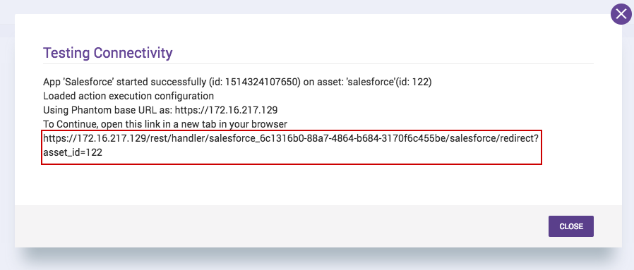

## Authentication

To pass test connectivity, you need to configure an app on Salesforce. To do so, navigate to
<https://www.salesforce.com/> in a browser and navigate to the login page. Log in with a Salesforce
account.

1. In the drop-down list of the account (in the upper-right corner), select **Setup**
1. Go to **Apps** , then **App Manager** and click on **New Connected App**
1. On the New Connected App page, fill the following required fields under Basic Information:
   - Connected App Name. For example, Salesforce Splunk SOAR App
   - API name. For example, Salesforce Splunk SOAR App
   - Contact Email. For example, xyz@xyz.com
1. Go to API (Enable OAuth Settings), and select Enable OAuth Settings. Fill it out as mention in
   the below image or else follow these steps
   - Under the **Callback URL** , we will be updating the entry of https://splunk_soar.local to
     reflect the actual redirect URI. We will get this while we create Splunk SOAR App's asset in
     the below section titled "Configure the Salesforce Phantom app's Asset"

   - Under **Selected OAuth Scopes field** add the following two scopes from **Available OAuth
     Scopes**

     - Access and manage your data(api)
     - Perform requests on your behalf at any time(refresh_token,ofline_access)

   - Select the **Require Secret for Web Server Flow** checkbox

     [](img/app_config.png)
1. Click on **Save**

## Configure the Salesforce Splunk SOAR app's Asset

When creating an asset for the **Salesforce** app, place the **Consumer Key** of the app created
during the previous step in the **Client ID** field and place the **Consumer Secret** generated
during the app creation process in the **Client Secret** field. Then, click **SAVE** .

After saving, a new field will appear in the **Asset Settings** tab. Take the URL found in the
**POST incoming for Salesforce to this location** field. To this URL, add **/start_oauth** . After
doing so the URL should look something like:

https://\<splunk_soar_host>/rest/handler/salesforce_6c1316b0-88a7-4864-b684-3170f6c455be/\<asset_name>/start_oauth

[](img/asset_config.png)

Click **Edit** on the app created in a previous step and place it in the **Callback URL** field.

Once again, click on Save.

## Method to Run Test Connectivity with Oauth

After setting up the asset, click the **TEST CONNECTIVITY** button. A window should pop up and
display a URL as shown in the below image. Navigate to this URL in a separate browser tab. This new
tab will redirect to a Salesforce login page. Log in to a Salesforce account. Finally, close that
tab when instructed to do. The test connectivity window should show a success. **The app should now
be ready to use.**

[](img/modal.png)

## Method to Run Test Connectivity with Username and Password

If you optionally specify username and password in the asset configuration, test connectivity will
work differently; the main difference being that when you launch the test connectivity, there is no
need to log into the Salesforce instance to authorize the app.

**Note:** The password field should be composed of your password with your account's security token
appended at the end. Example: MyPasswordMyToken (this is not the same as the **client_secret** )

## Test Environment

You may want to configure an asset to work with a Salesforce test environment. This is the case if
the login URL for that Salesforce instance is <https://test.salesforce.com> as opposed to
<https://login.salesforce.com> . In this case, you should check the appropriate box in the asset
configuration.

## Ingestion

### Common points for scheduled interval polling and manual polling

- The parameters of the On Poll action ignored in this application are start_time, end_time,
  container_id, artifact_count.

- The data will be fetched based on the value specified in the configuration parameters 'Poll for
  this Salesforce Object'(default value is Case if not specified) and 'Poll this List View'
  parameter. To ingest objects, a ListView should be specified.

- The created artifact's CEF fields will be the same names as the fields in the Object in
  Salesforce. You may want to map these to standard CEF fields. This can be done by providing a
  JSON that describes the mapping. For example, if the Salesforce object has the field
  **ip_address\_\_c** , and you want this to be **sourceAddress** , the following file would be
  appropriate.

  ```shell
                  
                  {
                      "ip_address__c": "sourceAddress"
                  }
                  
                  
  ```

### 'Include view data in artifact' Configuration Parameter

- This configuration parameter can be used to prevent the creation of duplicate artifacts.
- If disabled, the on poll will ignore the value of "LastViewedDate" and "LastReferencedDate"
  during artifact creation.
- If enabled, the on poll will include the value of "LastViewedDate" and "LastReferencedDate"
  during artifact creation.
- Case is an example of an object in which both the values (LastViewedDate and LastReferencedDate)
  are present.

### Scheduled | Interval polling

- During scheduled | interval polling, the app will start from the first object and will ingest
  up to the number of objects specified in the 'Get this many results on first ingestion'(Default
  value 10) parameter. Then it remembers the last object's offset Id and stores it in the state
  file against the key 'cur_offset'. The next scheduled ingestion will start from the offset Id in
  the state file and will ingest all the remaining objects of defined ListView.

### Manual polling

- During manual polling, the app will start from the first object and will ingest up to the number
  of objects specified in the 'Maximum containers' parameter.

## Note

- Currently, the **List Objects** , the **List Tickets** , and the **On Poll** actions can fetch a
  maximum of 4000 records. The maximum offset value supported by the Salesforce API is 2000, as
  mentioned in this [**documentation**
  .](https://developer.salesforce.com/docs/atlas.en-us.soql_sosl.meta/soql_sosl/sforce_api_calls_soql_select_offset.htm)
  If this issue gets resolved with the Salesforce API, then the mentioned actions will be able to
  fetch all of the records.
- The List of available standard objects can be found
  [here](https://developer.salesforce.com/docs/atlas.en-us.object_reference.meta/object_reference/sforce_api_objects_list.htm)
  .
- While using custom object's name as input parameter use "API Name" attribute of that object.
